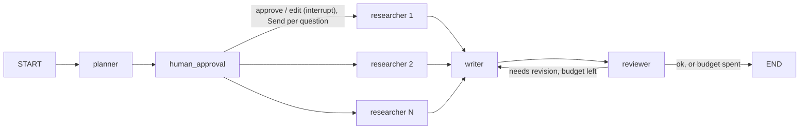
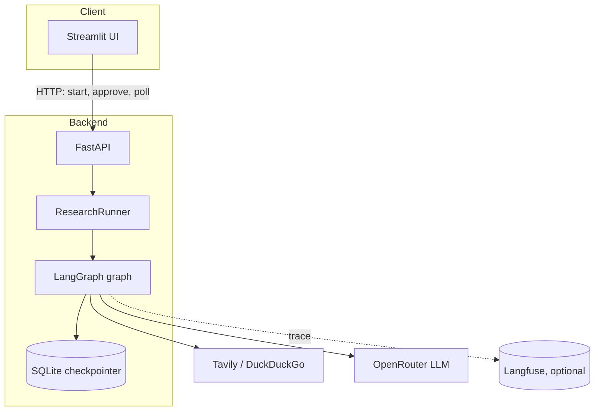

# company-research-agent

A LangGraph agent that researches a company on the web and writes a sourced markdown report. A
human approves (or edits) the research plan before any search runs. FastAPI serves the graph,
a Streamlit page drives it, and every research run is traced end-to-end in Langfuse.

Product scope and design decisions: [`docs/design.md`](docs/design.md) and
[`docs/architecture.md`](docs/architecture.md).

## Features

- **Plan, then approve**: the planner drafts 4-6 research questions; a human reviews, edits or
  approves them before any web search happens (`interrupt` / resume).
- **Parallel research**: one branch per approved question, searching the web (Tavily, DuckDuckGo
  fallback) and summarizing findings with local citations.
- **Sourced report with a self-review loop**: the writer produces a cited markdown report; the
  reviewer checks citation integrity and can send it back for one revision (configurable) before
  finalizing it with a generated Sources section.
- **Resumable**: the graph checkpoints to SQLite, so an approval can resume a run started earlier
  (including after an API restart).
- **Observability**: every research is one Langfuse trace (planning + resumed run share it); the UI
  links to it. Tracing is optional — the app runs without Langfuse keys.
- **Thin UI**: Streamlit only talks to the FastAPI backend over HTTP, polling for progress; it never
  imports the agent's domain code.

## Architecture





See [`docs/architecture.md`](docs/architecture.md) for components, the data-flow sequence
diagram and the trade-offs behind each design decision.

## Quickstart

### Docker Compose

```bash
docker compose up --build
```

- UI: http://localhost:8501
- API: http://localhost:8000 (docs at http://localhost:8000/docs)

`.env` is optional and read by the `api` service if present (copy `.env.example` to `.env` first).
Checkpoints persist in a named Docker volume.

### Local, with `uv`

```bash
uv sync                          # install deps (if uv is missing: pip install uv)
cp .env.example .env              # then fill in OPENROUTER_API_KEY at least

# terminal 1: API
uv run uvicorn company_research_agent.api.app:app --reload --port 8000

# terminal 2: UI
uv run streamlit run src/company_research_agent/ui/app.py
```

The UI reads the API base URL from `API_URL` (defaults to `http://localhost:8000`).

## Configuration

Environment variables (see [`.env.example`](.env.example) and
[`config.py`](src/company_research_agent/config.py)):

| Variable | Default | Description |
| --- | --- | --- |
| `OPENROUTER_API_KEY` | *(empty)* | Required. OpenRouter key used for every LLM call; the API fails at startup if it is missing. |
| `OPENROUTER_BASE_URL` | `https://openrouter.ai/api/v1` | OpenRouter (OpenAI-compatible) endpoint. |
| `LLM_MODEL` | `google/gemini-3.8-flash` | Model id passed to OpenRouter. |
| `LLM_TIMEOUT_SECONDS` | `60` | Per-call LLM timeout. |
| `LLM_INPUT_PRICE_PER_MTOK` | `0.30` | USD per million input tokens, used only to estimate cost per research. |
| `LLM_OUTPUT_PRICE_PER_MTOK` | `2.50` | USD per million output tokens, same purpose. |
| `LANGFUSE_PUBLIC_KEY` | *(empty)* | Optional. Leave empty (with the secret key) to disable tracing entirely. |
| `LANGFUSE_SECRET_KEY` | *(empty)* | Optional, see above. |
| `LANGFUSE_HOST` | `https://cloud.langfuse.com` | Langfuse host. |
| `TAVILY_API_KEY` | *(empty)* | Optional. Without it, search falls back to DuckDuckGo only. |
| `SEARCH_MAX_RESULTS` | `5` | Max results kept per search query. |
| `CHECKPOINT_DB` | `data/checkpoints.sqlite` | Path to the SQLite checkpoint database. |
| `MAX_REVISIONS` | `1` | Max writer revisions the reviewer can request. |
| `API_URL` | `http://localhost:8000` | Base URL the Streamlit UI uses to call the API. |

## API

- `GET /health` — liveness check.
- `POST /research` — `{"company": "..."}` → runs the graph up to the approval interrupt, returns
  `{"thread_id", "plan"}`.
- `POST /research/{thread_id}/approve` — `{"plan": ["..."] | null}` (omit `plan` to approve as-is)
  → `202`, resumes the run in the background.
- `GET /research/{thread_id}` — status (`awaiting_approval | running | done | failed`), current
  node, report and sources, token usage, estimated cost, latency and Langfuse trace URL once done.

```bash
curl -s -X POST http://localhost:8000/research -H "Content-Type: application/json" \
  -d '{"company": "Hugging Face"}'
# {"thread_id": "…", "plan": ["…", "…"]}

curl -s -X POST http://localhost:8000/research/<thread_id>/approve \
  -H "Content-Type: application/json" -d '{}'

curl -s http://localhost:8000/research/<thread_id>
```

## Testing

```bash
uv run pytest tests/unit -q            # fast unit tests (no keys, no network)
uv run pytest -m integration           # full graph + API on a SQLite file, no Docker needed
uv run pytest -m llm                   # real LLM calls through OpenRouter, manual only
uv run pytest -m "not llm" --cov --cov-report=term-missing   # unit + integration, with coverage
```

CI (`.github/workflows/ci.yml`) runs `ruff format --check`, `ruff check`, `mypy --strict`,
`vulture`, `deptry`, and the test suite (excluding `llm`) with coverage (`fail_under = 80`), then
builds and pushes the Docker image on `main`.

## Observability

Every graph run is one Langfuse trace: the planning call and the resumed run after approval share
it (the trace id is derived from the thread id), so the whole research — planner, human approval,
parallel researchers, writer, reviewer — shows up as one timeline with token usage and latency per
node. The API exposes the trace link (`trace_url`) once a research is done, and the UI shows it as
a button next to the report. Tracing is entirely optional: without `LANGFUSE_PUBLIC_KEY` /
`LANGFUSE_SECRET_KEY` the app runs normally and every field that depends on Langfuse is `null`.

## Tech stack

LangGraph and LangChain for the agent graph, FastAPI for the HTTP API, Streamlit for the UI,
OpenRouter (OpenAI-compatible) for LLM access, Tavily and DuckDuckGo for web search,
`langgraph-checkpoint-sqlite` for persistence and resumability, Langfuse for tracing, `uv` for
dependency management, `ruff` / `mypy` / `vulture` / `deptry` for static checks, `pytest` for
testing, Docker Compose for local orchestration.

## Development

This project is developed with an AI-assisted workflow using [Claude Code](https://claude.com/claude-code):
project context in [`CLAUDE.md`](CLAUDE.md), specialized agents, slash commands and hooks in
[`.claude/`](.claude/) (auto-formatting, secret protection, session context).

## License

MIT
