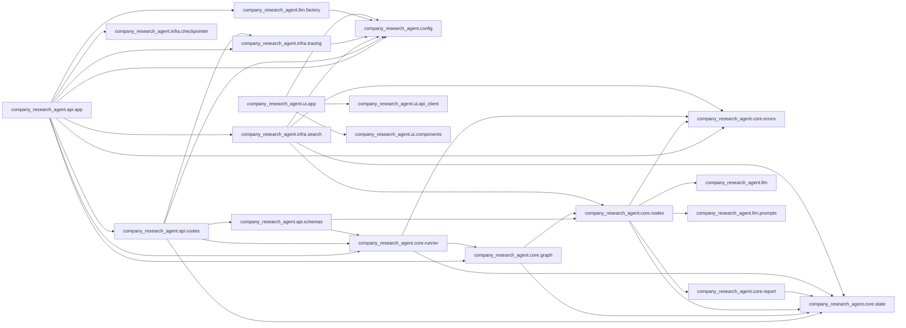

# Code map

Generated by `scripts/code_map.py`. Do not edit by hand.

## Modules not imported by any other module

- `company_research_agent.api`
- `company_research_agent.core`
- `company_research_agent.infra`
- `company_research_agent.ui`
